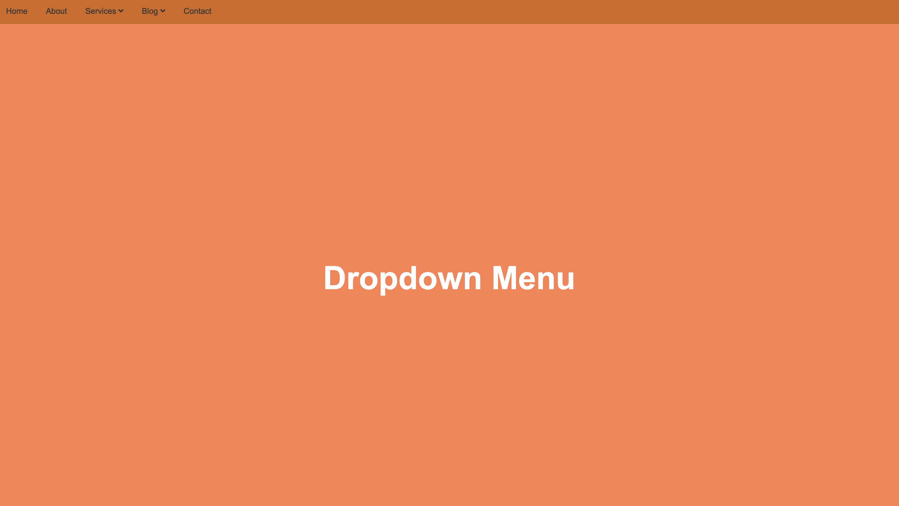

# CSS-dropdown-menu (UI mastery series 6 of 8)

## Description

This mini project is the sixth in my UI mastery series. The UI mastery series is a series I created consisting of eight total projects (mini and full projects) to really master my UI development skills. For this project, I've built a beautiful single page with a dropdown menu.

## Screenshot

## Deployed Application

https://osamadahnoun.github.io/CSS-dropdown-menu/

## Contribution

Made with love by Osama Dahnoun ❤️
